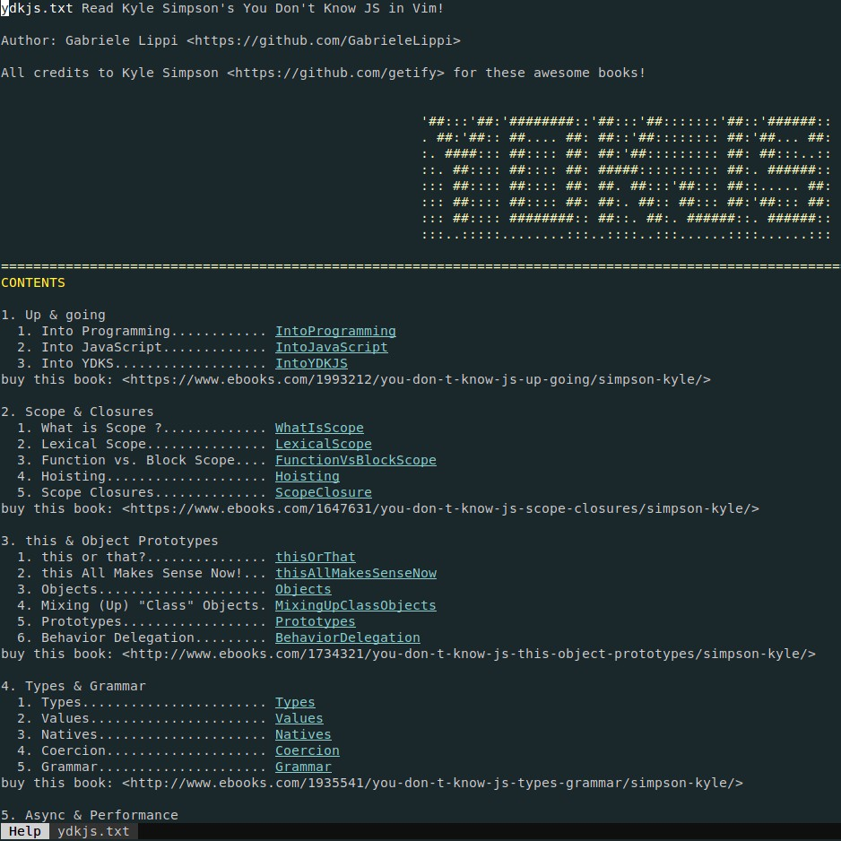

# You Don't Know JS (book series) in Vim doc!

This is the awesome series of books diving deep into the core mechanisms of the JavaScript language, written by Kyle Simpson, made available right at your fingertips in Vim documentation.

## How it works:

Simply type `:help ydkjs.txt` to open in a Vim buffer the entire book. 

You can easily jump to the section you are looking for by selecting the chapter in the index.

Vim documentation doesn't support all the available syntax highlighting that markdown does, but we can have:
 * title formatting
 * highlighting inline code-like
 * a basic but useful code formatting

## License & Copyright

The materials herein are all &copy; 2013-2018 Kyle Simpson.

Please note that all the books are written by Kyle Simpson, and all credits go to him; I only made available in Vim's documentation format the text that everyone could read for free here:

  * [Read for free YDKJS](https://github.com/getify/You-Dont-Know-JS)

Or buy here: 

* Published: [Buy Now](http://www.ebooks.com/2481820/you-don-t-know-js-es6-beyond/simpson-kyle/)
* Published: [Buy Now](http://www.ebooks.com/1993212/you-don-t-know-js-up-going/simpson-kyle/) in print, but the ebook format is free!
* Published: [Buy Now](http://www.ebooks.com/1647631/you-don-t-know-js-scope-closures/simpson-kyle/)
* Published: [Buy Now](http://www.ebooks.com/1734321/you-don-t-know-js-this-object-prototypes/simpson-kyle/)
* Published: [Buy Now](http://www.ebooks.com/1935541/you-don-t-know-js-types-grammar/simpson-kyle/)
* Published: [Buy Now](http://www.ebooks.com/1977375/you-don-t-know-js-async-performance/simpson-kyle/)
